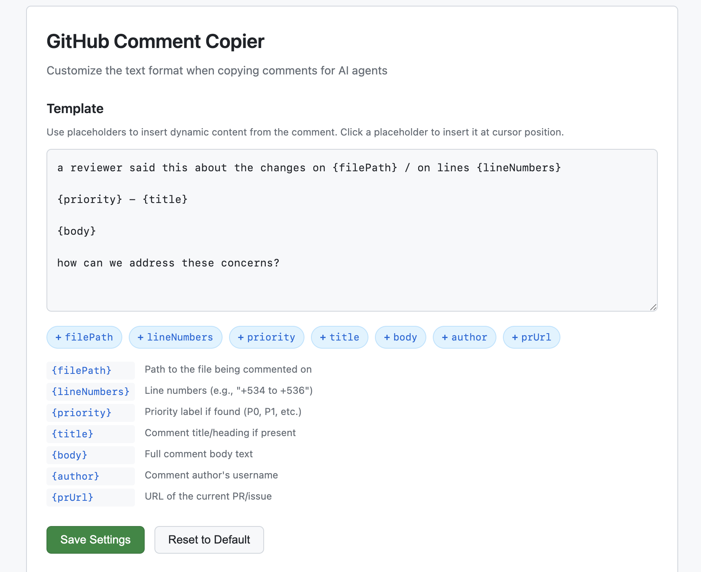

# GitHub Comment Copier

A Chrome extension that adds a copy button to GitHub comments, formatting them for easy pasting into AI agents like Claude Code, Codex, etc.

## Features

- Adds a copy button below each GitHub comment
- Extracts file path, line numbers, priority labels (P0-P4), and comment body
- Removes boilerplate text (e.g., "Useful? React with", "About Codex in GitHub")
- Works on PR reviews, issues, and discussions
- Supports both light and dark GitHub themes
- Fully customizable output template

## Installation

1. Clone or download this repository
2. Open Chrome and go to `chrome://extensions/`
3. Enable "Developer mode" (toggle in top right)
4. Click "Load unpacked"
5. Select the `github-comment-copier` folder

## Usage

1. Navigate to any GitHub PR, issue, or discussion
2. Find a comment you want to copy
3. Click the copy button (clipboard icon) below the comment
4. Paste into your AI agent

## Example Output

```
a reviewer said this about the changes on apps/azalt/src/server/api/routers/inbox/methods.ts / on lines +534 to +536

P1 - Use element schedules when gating inbox tasks

`showEntry` is derived only from `entryDueDateSpec`/`entryDueDay`, which come from form-level defaults...

how can we address these concerns?
```

## Customization

You can customize the copied text format through the extension options:

1. Go to `chrome://extensions/`
2. Find "GitHub Comment Copier" → click "Details"
3. Click "Extension options"



### Available Placeholders

| Placeholder | Description |
|-------------|-------------|
| `{filePath}` | Path to the file being commented on |
| `{lineNumbers}` | Line numbers (e.g., "+534 to +536") |
| `{priority}` | Priority label if found (P0, P1, etc.) |
| `{title}` | Comment title/heading if present |
| `{body}` | Full comment body text |
| `{author}` | Comment author's username |
| `{prUrl}` | URL of the current PR/issue |

### Default Template

```
a reviewer said this about the changes on {filePath} / on lines {lineNumbers}

{priority} - {title}

{body}

how can we address these concerns?
```

### Custom Template Example

```
## Review Comment
**File:** {filePath}
**Lines:** {lineNumbers}
**Author:** {author}

{body}

---
Link: {prUrl}
```

## Supported Comment Types

- PR inline review comments (on specific lines)
- PR conversation comments
- Issue comments
- Discussion comments
- Codex/bot review comments

## License

MIT
